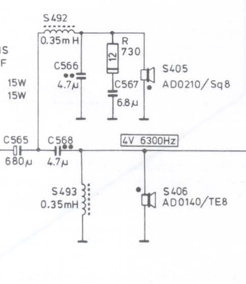
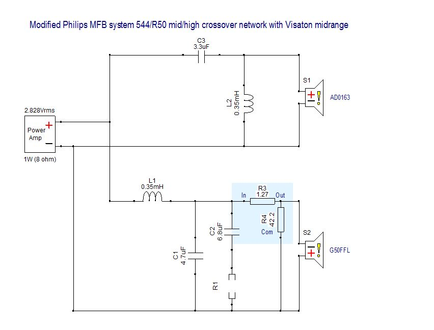
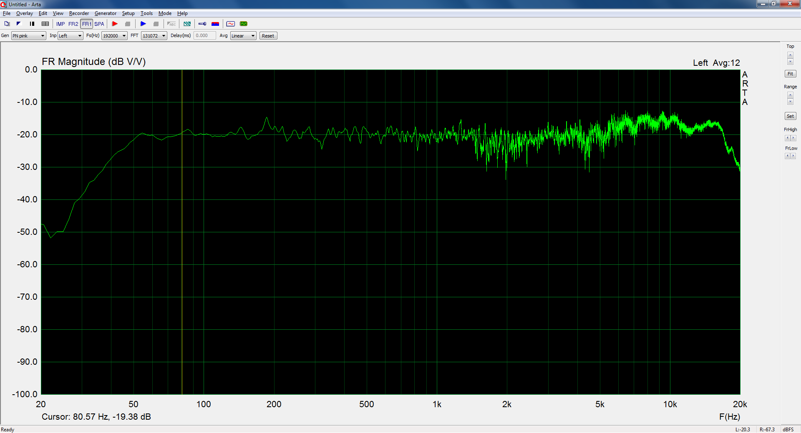
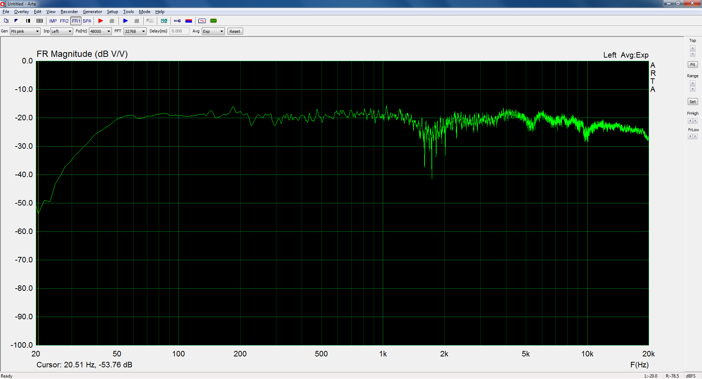
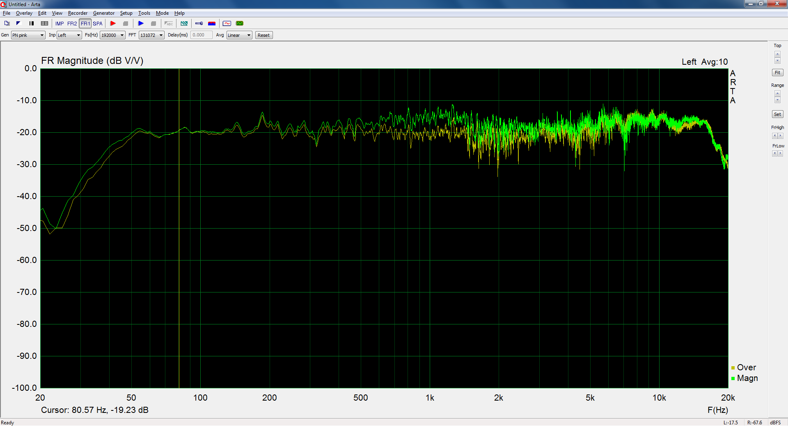
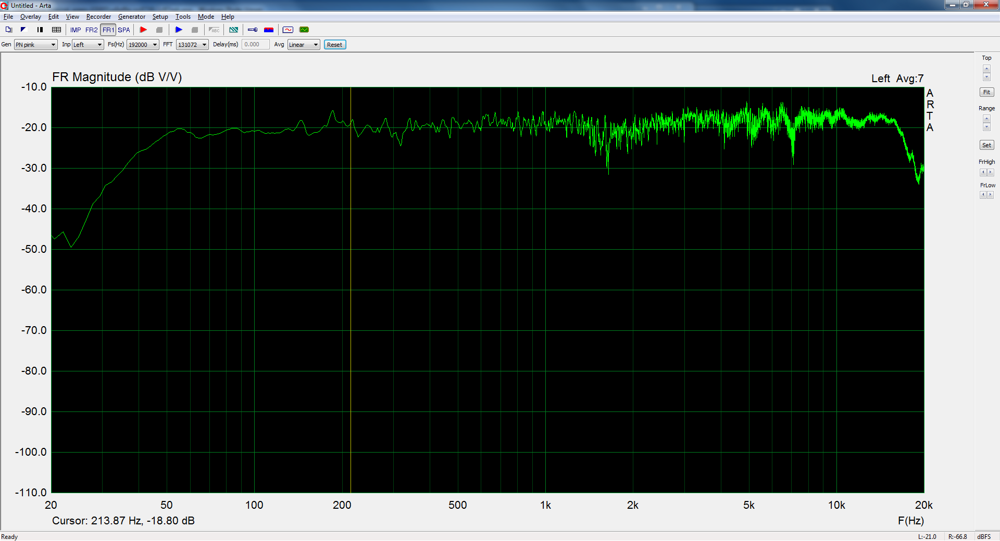

# Squawker and Tweeter Modification for the Philips 544 MFB Speaker

This repository contains design information of 3D printable adapter parts to replace the original midrange and high frequency driver from the Philips 22RH544 MFB speaker with Visaton drivers. Feel free to fork this project to improve this modification proposal.

ORIGINAL 544 | MODIFIED 544 | BEST COMPROMISE
------------ | ------------ | ---------------
 |  | 

The following driver substitutes were selected because of their attractive price, quality and form-factor, which comes the closest to the original drivers:

PHILIPS | VISATON
------- | -------
Squawker AD0211/SQ8 | Visaton G 50 FFL dome midrange [1]
Tweeter AD0163/TE8 | Visaton G 20 SC dome tweeter [2]

## Why upgrading?
- The Philips AD0211/Sq8 squawker most often fails and a replacement must be found [3], [4].
- Overall improvement of the sound quality of the midrange and high frequencies.

## Conclusion
Attempt #3 seems the best compromise. It is the combination of the Visaton G50FFL soft dome midrange driver with the new baffle/horn design and the original Philips AD0163 tweeter. The provided solution solves the problem of a faulty AD0211.
The frequency response is as good as the original. Minimal modification of the electronics is needed for the 22RH544/50R. 

## Design for 3D-printed parts
Attempt | openSCAD files | Remarks
------- | -------------- | -------
 #1 | G50FFL_spacer_v1.scad G20SC_spacer_v1.scad | Mid driver sticks out above the baffle causing(?) a worse dip in the frequency reponse around 1.8kHz. The tweeter spacer does not need extra fixation holes to be drilled in the brackets. M4 hex-nuts can be pressed into the holes intended for mounting the tweeter on top of the spacer ring.  (3D-print with support on). The dust covers can not be put back, because the driver domes are sticking too far outside. 
 #2 | G50FFL_baffle_v1.scad G20SC_spacer_v2.scad | Attempt two with a new baffle/horn design for the G50FFL. (3D-print with support on). The dome is placed inwards to the original position of the AD0211 dome. The metal flange of the G50FFL must be removed by removing the four screws from the front side. The extra gasket, included with the G50FFL package, must be used between the driver and the new baffle/horn. The tweeter has been replaced by the G20SC and has been placed deeper inwards too. It is mounted with a 2mm spacer ring, leaving enough room for extreme woofer excursions. Fixation holes must be drilled in the brackets for mounting. The dust covers can be put back on. A small dip in the frequency response has been observed around the mid/high crossover frequency (~5kHz).
 #3 | G50FFL_baffle_v1.scad | The squawker AD0211 has been replaced by the G50FFL with the new baffle/horn design as in attempt #2. The original AD0136 tweeter has been restored.  The midrange frequencies around 1kHz are elevated a few dB's compared to the original. A minor modification in the electronics solves this problem.
Bonus | 544_capstand.scad | Capacitor mount, see pictures below. 

# 

## Assembly
### G50FFL baffle
Push the washers (M4) into the holes | Remove the flange from the Visaton G50FFL carefully
------------------------------------ | ---------------------------------------------------
 |  | 

Place the spare gasket | Mount the baffle and cutaway the redundant gasket material
---------------------- | ----------------------------------------------------------
 | 

| Mount the completed driver assembly | 
| ----------------------------------- |
|  |

### Capacitor mount
BEFORE | AFTER
------ | -----
 | 
 
Recommended capacitors:

* C588, C535 = 4700 μF/63V, Vishay BCcomponents, 058/059 PLL-SI series aluminium capacitors, radial snap in 35 mm. (Conrad article #446251)
* C565 = 680 μF/40V, Panasonic EEU-FR1J681L series, radial 12.5 mm. (Conrad article #1476134)

## Modification of the electronics
To approach the original frequency response for attempt #3, the following modifications should be made in the electronics of the 22RH544/50R:

* The frequency correction network consisting of R730 and C567 from the crossover network, should be disabled by removing R730.
* An L-pad network consisting of an 1.2 Ohms series resistor and a 47 Ohms parallel resistor should be placed between the crossover filter and the G50FFL driver (S405). This will add 1.5dB attenuation for the midrange. Simulations were performed with Xsim [5].

| The 544 crossover network. In /50R, C568=3.3μF. |
| ----------------------------------------------- |
|  |
|  |

## Measurements
The frequency response measurements were carried out with the Behringer ECM 8000 calibration microphone [6] located at 30cm distance from the center of the speaker. From this distance, the individual response of the drivers already balances out and the influence of the room is minimal.
The frequency analyzer program that was used is Arta from Artalabs [7].

| Original 544 frequency response | 
| ------------------------------- |
|  The boost in the high frequency range is remarkable. The reason for this could be the microphone. The factory datasheet of the ECM 8000 shows a somewhat elevated and rippled frequency response between 5kHz and 10kHz. |

| Frequency response attempt #2 | 
| ----------------------------- |http://libinst.com/
|  A dominant frequency dip does appear around 1.8kHz and the G20SC starts rolling off from 9kHz (?) |
 
| Frequency response attempt #3 | 
| ----------------------------- |
|  *Yellow trace: the original 544 frequency response, green trace: Visaton G50FFL midrange with new baffle/horn and Philips AD0163/TE8 tweeter, no modifications in the electronics.* A slight boost in the frequencies around 1kHz is noticeable. The midrange dominates. |
 
| Frequency response attempt #3, with modified electronics | 
| -------------------------------------------------------- |
|  *Visaton G50FFL midrange with new baffle/horn design, original Philips AD0163/TE8 tweeter and modified electronics.* |

[1]: https://www.visaton.de/en/products/dome-midranges/g-50-ffl-8-ohm

[2]: https://www.visaton.de/en/products/dome-tweeters/g-20-sc-8-ohm

[3]: https://www.mfbfreaks.com/reparatie-en-service/tips-en-trucs/reparatie-middentoner-22ah587/
 
[4]: http://www.transistorforum.nl/forum/index.php?mode=thread&id=19335
 
[5]: http://libinst.com/ 
 
[6]: https://www.behringer.com/Categories/Behringer/Microphones/Condenser/ECM8000/p/P0118#googtrans(en|en)
 
[7]: http://www.artalabs.hr/
