# Squawker and Tweeter Modification for the Philips 544 MFB Speaker

This repository contains design information of 3D printable adapter parts to replace the original mid+high drivers from the Philips 22RH544 MFB speaker with Visaton drivers.

ORIGINAL 544 | MODIFIED 544 | BEST COMPROMISE
------------ | ------------ | ---------------
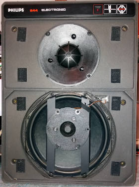 | 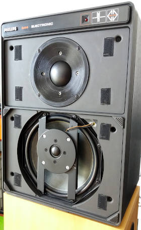 | 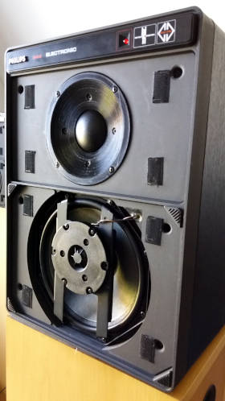

The following driver substitutes were selected because of their attractive price, quality and form-factor, which comes the closest to the original drivers:

* Squawker AD0211/SQ8 -> Visaton G 50 FFL dome midrange [1]
* Tweeter AD0163/TE8 -> Visaton G 20 SC dome tweeter [2].

## Why upgrading?
- The Philips AD0211/Sq8 squawker most often fails and a replacement must be found [3],[4].
- Overall improvement of the sound quality of the mid+high frequencies. 

## Conclusion
So far attempt #3 seems the best compromise. It is the combination of the Visaton G50FFL with the new baffle/horn design with the original Philips AD0163 tweeter. The frequency response is as good as the original. No modification of the electronics is needed from revision 22RH544/50R.
Using a L-pad to attenuate the mid+high range with 1 or 2 dB could be an option. It is a matter of taste. 

## Design for 3D-printed parts
Attempt | openSCAD files | Remarks
------- | -------------- | -------
 #1 | G50FFL_spacer_v1.scad G20SC_spacer_v1.scad | Mid driver sticks out above the baffle causing(?) a significant dip in the frequency reponse around 1.8kHz. The tweeter spacer does not need extra fixation holes to be drilled through the brackets. M4 hex-nuts can be pressed into the holes intended for mounting the tweeter on top of the spacer ring.  (3D-print with support on). The dust covers can not be put back, because the driver domes are sticking too far outside. 
 #2 | G50FFL_baffle_v1.scad G20SC_spacer_v2.scad | Attempt two with a new baffle/horn design for the G50FFL. (3D-print with support on). The dome is lowered down to the original dome position of the AD0211. The metal flange of the G50FFL must be removed by removing the four screws at the front side. The extra gasket, included with the G50FFL package must be used between the driver and the new baffle/horn. The tweeter has been replaced by the G20SC and has been lowered down too. It is mounted with a 2mm spacer ring, leaving enough room for extreme woofer excursions. Fixation holes must be drilled through the brackets before mounting. The dust covers can be put back. A minimal dip in the frequency response has been observed around the mid/high crossover frequency (~5kHz).
 #3 | G50FFL_baffle_v1.scad | The squawker AD0211 has been replaced by the G50FFL with the new baffle/horn design from attempt #2. The original AD0136 tweeter has been restored.  The mid+high is boosted a few dB's because the Philips AD0163 has a slightly higher efficiency compared to the G20SC and the G50FFL's efficiency is a little higher from the start of the midrange frequency band of the 544.
Bonus | 544_capstand.scad | Capacitor mount, see pictures below. 

# 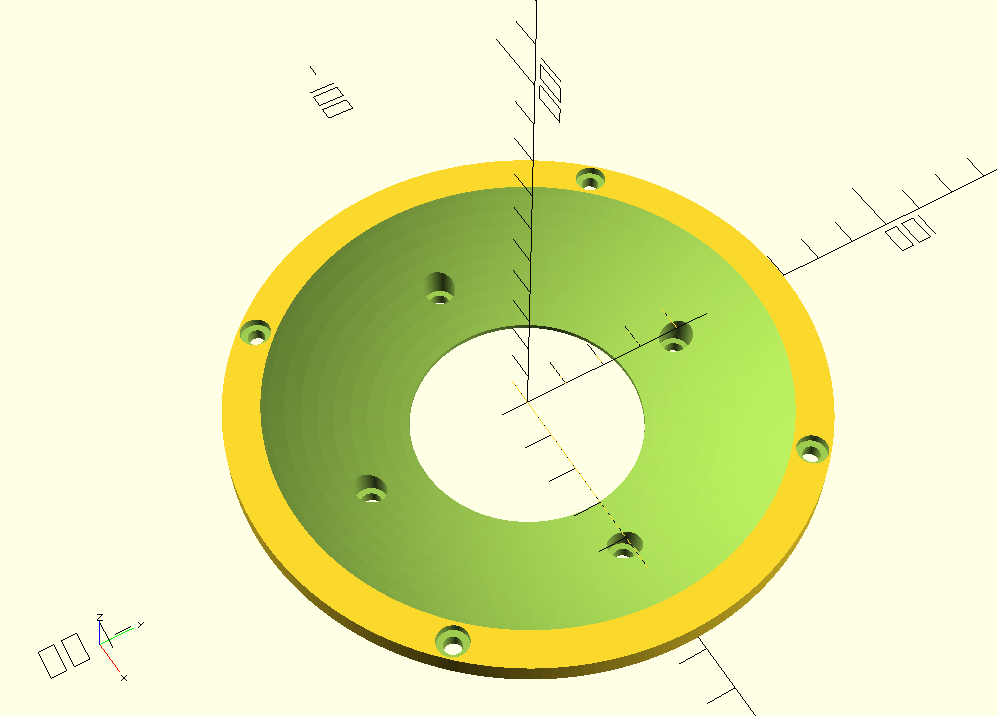

## Assembly

### G50FFL baffle

Push the washers (M4) into the screw holes. | Remove the flange from the Visaton G50FFL carefully.
------------------------------------------- | ----------------------------------------------------
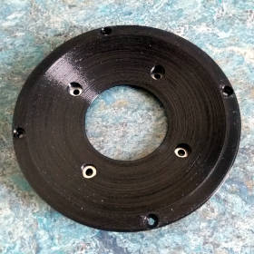 | 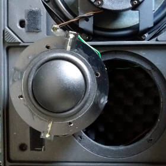 | 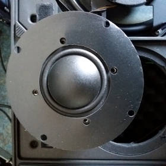

Place the spare gasket. | Mount the baffle and cutaway the redundant gasket material.
----------------------- | -----------------------------------------------------------
 | 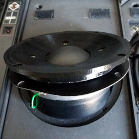

 | Mount the driver assembly. | 
 | -------------------------- |
 | 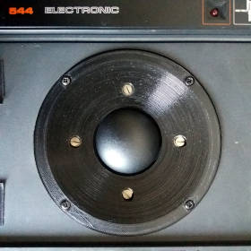 |

### Capacitor mount
BEFORE | AFTER
------ | -----
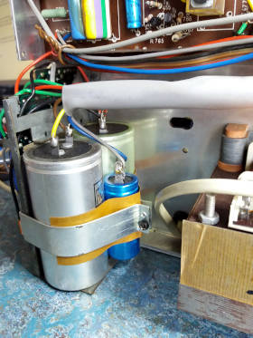 | 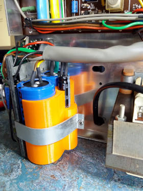
 
 Recommended capacitors:
 
* 4700 μF/63V, Vishay BCcomponents, 058/059 PLL-SI series aluminium capacitors, radial snap in 35 mm. (Conrad article #446251)
* 680 μF/40V, Panasonic EEU-FR1J681L series, radial 12.5 mm. (Conrad article #1476134)

[1]: https://www.visaton.de/en/products/dome-midranges/g-50-ffl-8-ohm

[2]: https://www.visaton.de/en/products/dome-tweeters/g-20-sc-8-ohm

 [3]: https://www.mfbfreaks.com/reparatie-en-service/tips-en-trucs/reparatie-middentoner-22ah587/
 
 [4]: http://www.transistorforum.nl/forum/index.php?mode=thread&id=19335 
